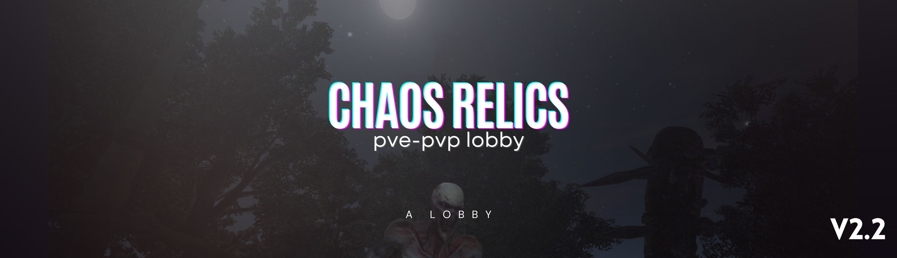
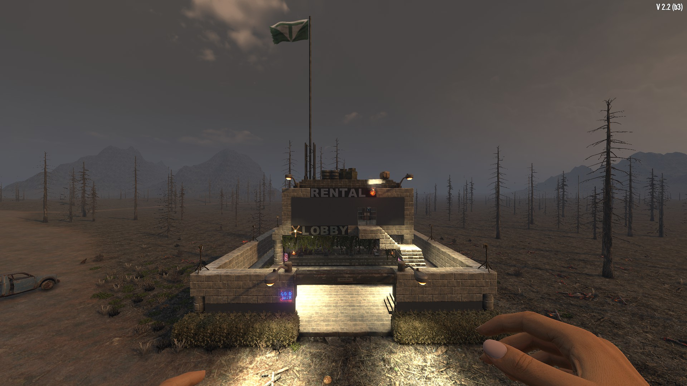
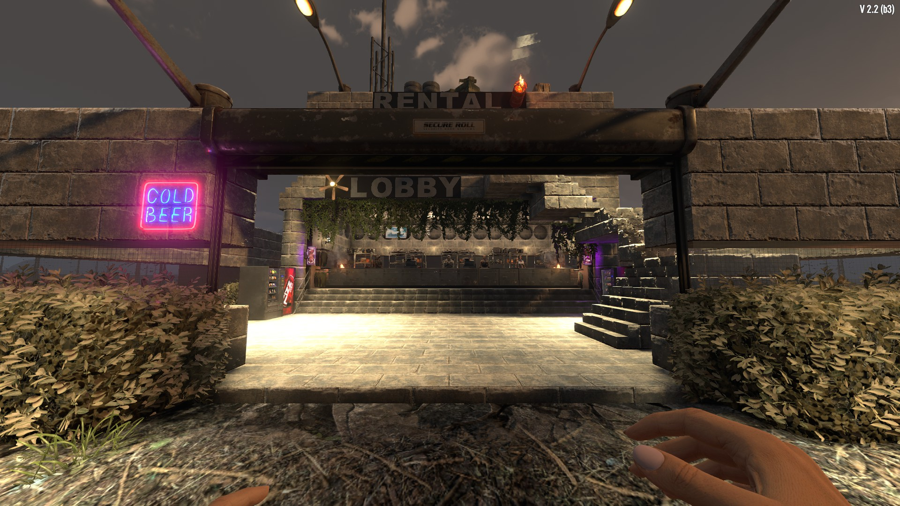
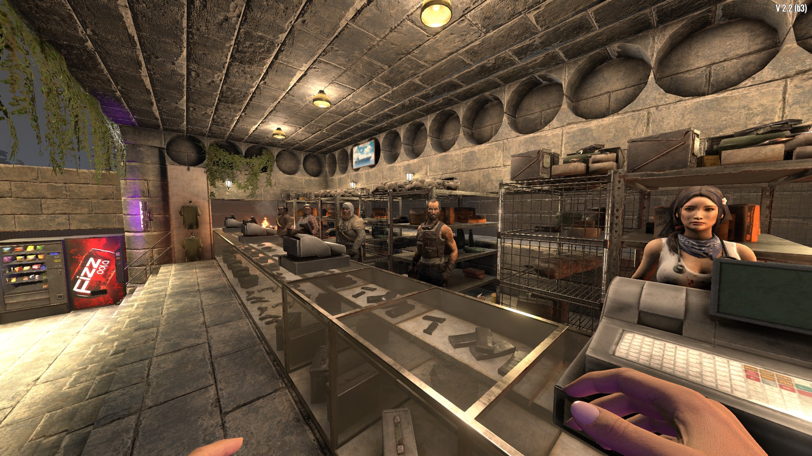
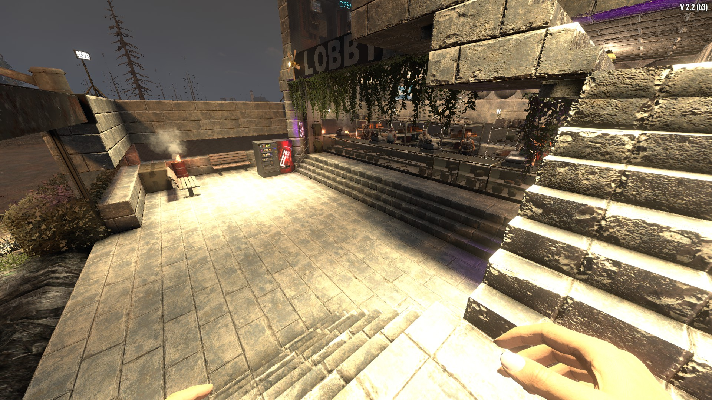
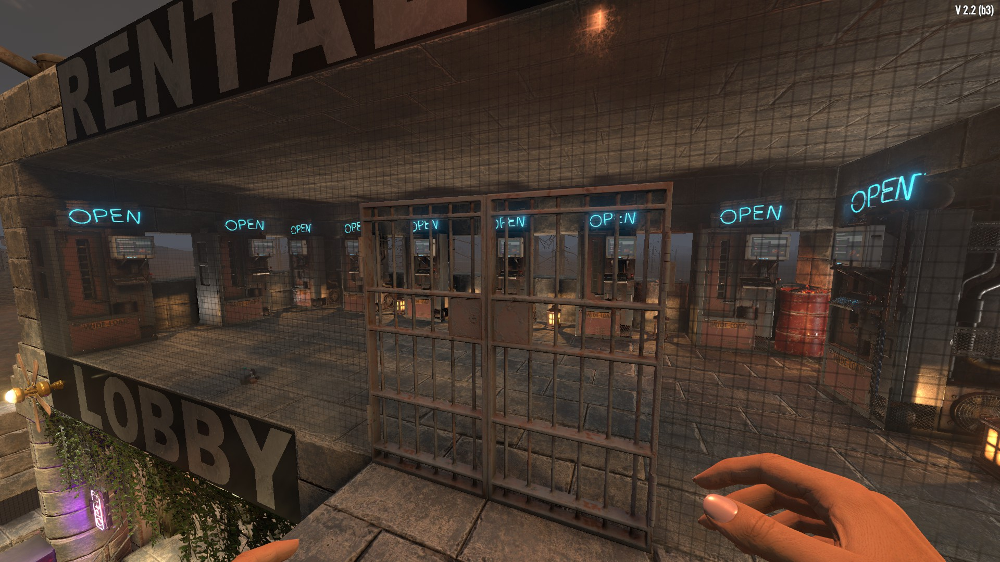
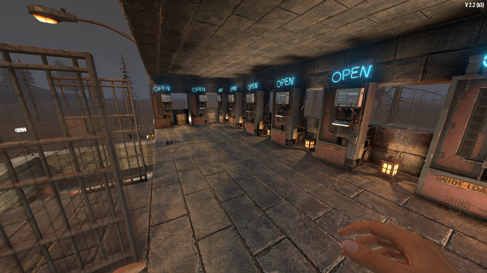
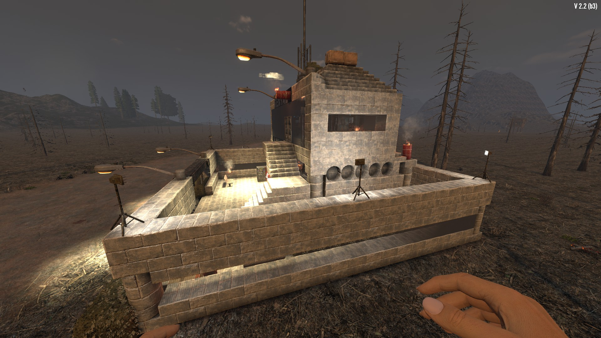
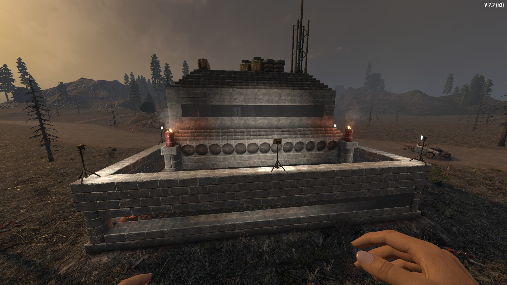
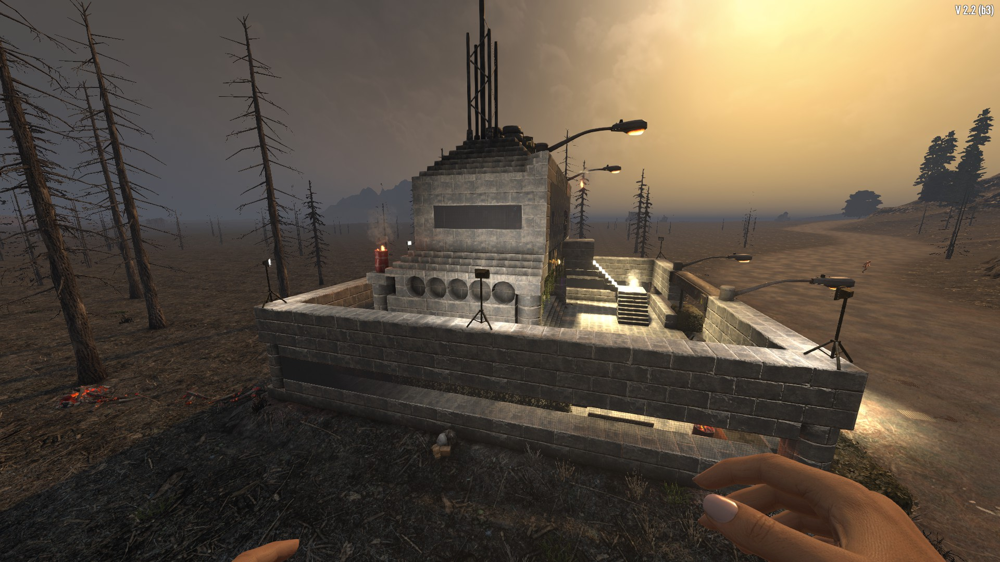

# CHAOS RELICS - Server Lobby Prefab

## 7 Days to Die Trader Prefab

[English](#english) | [Türkçe](#türkçe)

---

## English

This prefab is a **Server Lobby** and **Trader** structure designed for **7 Days to Die**. Optimized for PvP/PvE servers.

### Screenshots Gallery

📸 View More Screenshots

| View 1 | View 2 | View 3 |
|--------|--------|--------|
|  |  |  |
|  |  |  |
|  |  |  |

### Features

- **Size**: 23x32x22 blocks
- **Type**: Trader POI (Point of Interest)
- **Supported Traders**: Joel, Hugh, Bob, Jen, Rekt
- **Teleport System**: Included
- **Quest Objects**: Wood and Steel challenges
- **Difficulty Tier**: 0 (Suitable for beginners)

### Installation

1. Copy prefab files to the game's `Data/Prefabs/` folder
2. The prefab will be ready to use after server restart

### Files

- `CHAOS-RELICS-ServerLOBBY.xml` - Prefab configuration file
- `CHAOS-RELICS-ServerLOBBY.blocks.nim` - Block data
- `CHAOS-RELICS-ServerLOBBY.tts` - Terrain file
- `CHAOS-RELICS-ServerLOBBY.ins` - Instance file
- `screenshots/` - Prefab images

### Technical Details

- **Vertices**: 921,121
- **Triangles**: 265,112
- **Trader Positions**: 3 units
- **POI Lights**: 4 units
- **Teleport Volume**: 5x4x5

---

## Türkçe

Bu prefab, **7 Days to Die** oyunu için tasarlanmış bir **Server Lobby** ve **Trader** yapısıdır. PvP/PvE sunucuları için optimize edilmiştir.

### Ekran Görüntüleri Galerisi

📸 Daha Fazla Ekran Görüntüsü

| Görünüm 1 | Görünüm 2 | Görünüm 3 |
|-----------|-----------|-----------|
|  |  |  |
|  |  |  |
|  |  |  |

### Özellikler

- **Boyut**: 23x32x22 blok
- **Tür**: Trader POI (Point of Interest)
- **Desteklenen Tüccarlar**: Joel, Hugh, Bob, Jen, Rekt
- **Teleport Sistemi**: Dahil
- **Quest Objeler**: Wood ve Steel challenge'ları
- **Difficulty Tier**: 0 (Yeni başlayanlar için uygun)

### Kurulum

1. Prefab dosyalarını oyunun `Data/Prefabs/` klasörüne kopyalayın
2. Sunucu restart edildikten sonra prefab kullanıma hazır olacaktır

### Dosyalar

- `CHAOS-RELICS-ServerLOBBY.xml` - Prefab konfigürasyon dosyası
- `CHAOS-RELICS-ServerLOBBY.blocks.nim` - Blok verileri
- `CHAOS-RELICS-ServerLOBBY.tts` - Terrain dosyası
- `CHAOS-RELICS-ServerLOBBY.ins` - Instance dosyası
- `screenshots/` - Prefab'ın görüntüleri

### Teknik Detaylar

- **Vertices**: 921,121
- **Triangles**: 265,112
- **Trader Pozisyonları**: 3 adet
- **POI Işıkları**: 4 adet
- **Teleport Volume**: 5x4x5